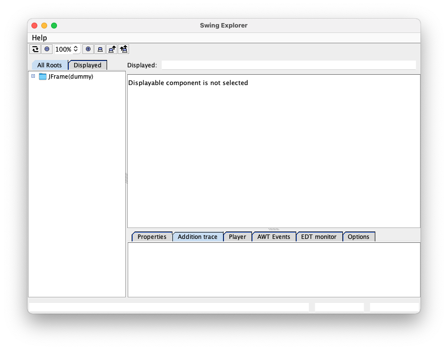

# SwingExplorer plugin for Intellij IDEA.

<!-- Plugin description -->
SwingExplorer is a tool for Java Swing application debugging.
This plugin integrates it into IntelliJ IDEA, to use it without external console

The plug-in was original contributed by <a href="mailto:pmlocek@gmail.com">Piotr Mlocek</a>.
Modified by <a href="mailto:wernerglanzer@googlemail.com">Werner Glanzer</a> (See on <a href="https://github.com/wglanzer/swingexplorer-idea">GitHub</a>).
<!-- Plugin description end -->

# How to use this plugin?

If you install this plugin you see a small blue arrow icon in your toolbar.

It gets enabled, if a java run configuration was selected.  
Click on it, and it will start your program, combined with the SwingExplorer.  
The SwingExplorer will show up in a new window and looks like this:

On the left side you get a complete overview of your swing component tree. Doubleclick on any item to "select" it and display it inside the main window. In the main part you then get a browseable
overview of your component - just try hovering over a component there!

On the lower side there are different properties, the addition stacktrace, and much more.

# License

Fork of http://swing-explorer.googlecode.com/svn/trunk/swing-explorer-idea/

Original Author: Piotr Mlocek License: GNU LGPL v3
